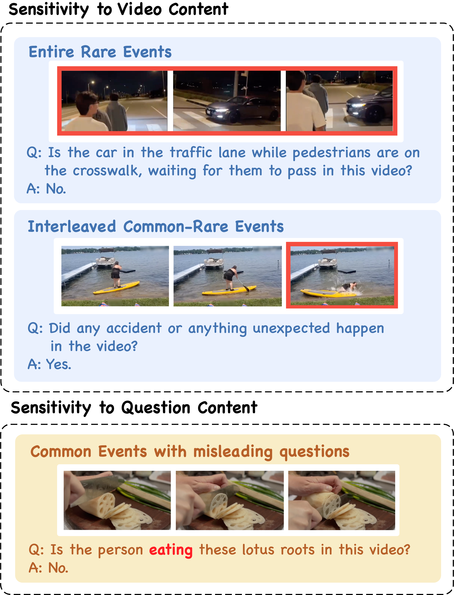

# EventHallusion
EventHallusion is the first benchmark that focuses on the evaluation of event hallucinations in Video LLMs. This repository includes the code and benchmark data of our paper "EventHallusion: Diagnosing Event Hallucinations in Video LLMs", by Jiacheng Zhang, Yang Jiao, Shaoxiang Chen, Jingjing Chen, and Yu-Gang Jiang.

<p align="center">
  
</p>

## Update
- [x] [2024/09/24] The GitHub repo of EventHalluion is created and the code for evaluation is released.

## Introduction
Recently, Multimodal Large Language Models (MLLMs) have made significant progress in the video comprehension field. Despite remarkable content reasoning and instruction following capabilities they demonstrated, the hallucination problem of these VideoLLMs is less explored compared with its counterpart in the image domain. To mitigate this gap, we first propose **EventHallusion**, a novel benchmark that focuses on assessing the VideoLMMs' hallucination phenomenon on video event comprehension. Based on the observation that existing VideoLLMs are entangled with the priors stemming from their foundation models, our EventHallusion is curated by meticulously collecting videos and annotating questions to intentionally mislead the VideoLLMs into interpreting events based on these priors rather than accurately understanding the video content. On the other hand, we also propose a simple yet effective method, called Temporal Contrastive Decoding (TCD), to tackle the hallucination problems of VideoLLMs. The proposed TCD suppresses the model's preference toward their priors by comparing the original video with a constructed counterpart, whose temporal cues are disrupted, during the autoregressive decoding stage. Through comprehensive evaluation of eight open-source and two closed-source VideoLLMs on the proposed EventHallusion benchmark, we find that the open-source models suffer significantly from hallucination problems, whereas the closed-source models perform markedly better. By further equipping open-sourced VideoLLMs with the proposed TCD approach, evident performance improvements are achieved across most metrics in the EventHallusion benchmark

## Getting Started
### Prepare Environment and Data
**a. Clone this repository.**

```shell
git clone https://github.com/Stevetich/EventHallusion.git
cd EventHallusion/
```

**b. Create the environment by conda and install necessary packages.**

```shell
conda create -n eventhallusion python=3.10 -y
conda activate eventhallusion
pip install -r requirements.txt
```

**c. Prepare Data.**

We have released our videos in . The questions for evaluation can be found in `questions/`.

### Run inference
**1. GPT-4o**
We provide scripts for inference with gpt-4o. First, input your own openai api key in `run_gpt4o.py` file, and run with:
```shell
python run_gpt4o.py --video_path <downloaded_video_path>
```

**2. Video LLaVA**
We also provide a simple example of evaluating Video-LLaVA
